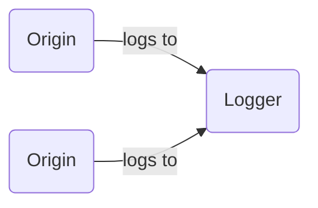
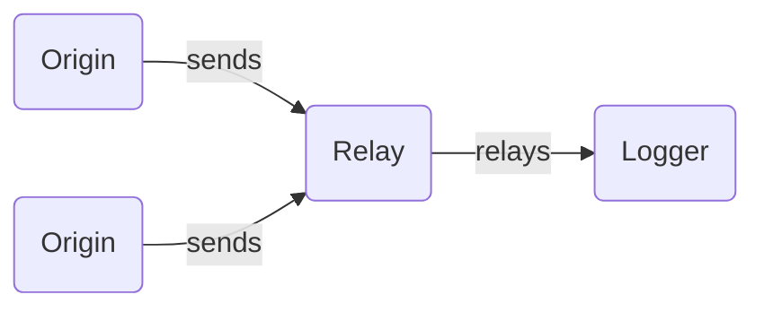
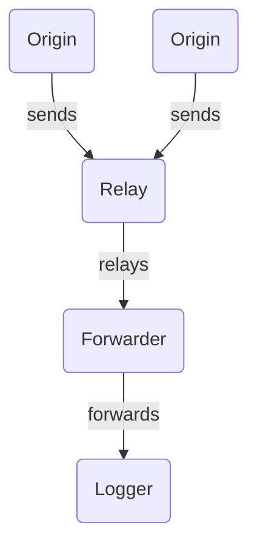

# Open Cybersecurity Schema Framework 

This is the Open Cybersecurity Schema Framework (OCSF) schema repository. The repository contains  JSON files of the Open Cybersecurity Schema Framework (OCSF).

## OCSF Architecture

A production logging architecture is likely to use multiple *devices* and *services* working together to handle log data. Some will generate log data, and they are called **Origin**. Some will collect data from multiple origins and forward the log data to a logger, they are called **Relay**. Finally, centralized logging systems receive and store the log data, those are called **Logger**. The Event Schema is defined from the point of view of the centralized event logging system. 

The *Logger* adds the **reserved** attributes to the event `metadata` such as `uid`, `version`, `log_time`, and `log_name`.

The following diagrams show some common logging scenarios that the OCFS coverts.

1. A device (Origin) creates events and directly sends them to the Logger. Or, the Logger directly collects event data from the device that created the events.

2. A device (Origin) creates events and forwards them to an intermediate server (Replay), which replays the log data to the Logger. For example, this is the case of syslog server or Windows domain controller that collects log data from multiple devices.

3. A device (Origin) creates events and sends them to an intermediate server (replay), which replays the events to a Forwarder server, which forwards the events to the Logger server. For example, this is the case when data is generated on premises and forwarded to a cloud-based centralized logging system.

## Extending the Schema
The OCSF Schema can be extended by adding new attributes, objects, classes, and profiles.

To extend the schema create a new directory in the `schema/extensions` directory. The directory structure is the same as the top level schema directory, and it may contain the following files and subdirectories.

| Name              | Description                                                  |
| ----------------- | ------------------------------------------------------------ |
| `categories.json` | Create it to define a new event category to reserve a range of class IDs. |
| `dictionary.json` | Create it to define new attributes.                          |
| `events`          | Create it to define new event classes.                       |
| `objects`         | Create it to define new objects.                             |

