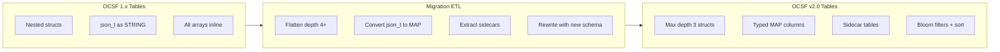

# OCSF Storage Layer Design: Iceberg & Delta Lake

> Analysis of OCSF schema structure against Apache Iceberg and Delta Lake
> columnar storage formats. Identifies friction points, recommends design
> patterns, and proposes v2.0 changes to make OCSF natively
> columnar-friendly.

---

## 1. Current OCSF-to-Columnar Friction Points

### 1.1 Extreme Column Expansion

When OCSF events are flattened to Parquet leaf columns (as required by
Iceberg/Delta), the column counts are far beyond typical table widths:

| Event Class | Top-Level Attrs | Leaf Columns (Flattened) |
|---|---|---|
| `detection_finding` | 75 | ~24,725 |
| `compliance_finding` | 75 | ~23,663 |
| `security_finding` | 70 | ~15,300 |
| `authentication` | 75 | ~13,515 |
| `rdp_activity` | 85 | ~13,809 |
| `network_activity` | 77 | ~12,999 |
| `file_activity` | 61 | ~11,249 |
| `base_event` | 54 | ~9,914 |

For context, most analytics databases perform well with tables under
1,000 columns. Parquet file footer metadata scales linearly with column
count. At 10,000+ columns:

- **Parquet file footers** become multi-megabyte, slowing file open times
- **Iceberg manifest entries** bloat with per-column statistics
- **Query planning** degrades as the optimizer must evaluate thousands of
  column projections
- **Small file compaction** becomes memory-intensive

The root cause is deeply nested, reusable objects. The `device` object
alone has 65 attributes, many of which are themselves objects (`os`,
`location`, `network_interfaces[]`, `groups[]`, `agent_list[]`). When
`device` appears in an event class (directly or via `actor`, `src_endpoint`,
etc.), it recursively expands to hundreds of leaf columns per reference.

### 1.2 Deep Nesting (5 Levels)

All analyzed event classes reach **5 levels of nesting**:

```
attacks.mitigation.countermeasures.d3f_tactic.*
attacks.mitigation.countermeasures.d3f_technique.*
malware.cves.cvss.metrics.*
actor.user.account.credential_uid.*
```

Parquet supports nested structs, but:

- **Predicate pushdown** is unreliable below 2-3 levels in most engines
  (Spark, Trino, Athena)
- **Column pruning** works but requires verbose fully-qualified paths
- **SQL ergonomics** degrade: `WHERE actor.user.account.name = 'admin'`
  vs. `WHERE actor_user_account_name = 'admin'`
- **Dremel encoding** (Parquet's repetition/definition levels) becomes
  complex at deep nesting, increasing CPU cost for assembly

### 1.3 `json_t` Fields (19 Instances)

OCSF has **19 `json_t` fields** across objects:

```
application.data          databucket.data         edge.data
enrichment.data           evidences.data          finding.supporting_data
managed_entity.data       node.data               policy.data
query_info.data           request.data            resource_details.data
response.data             scim.scim_group_schema  scim.scim_user_schema
tls_extension.data        web_resource.data       win/reg_value.data
win/win_resource.data
```

In Iceberg/Delta, `json_t` maps to `STRING` -- an opaque blob with:

- **No predicate pushdown** -- can't filter on nested JSON keys
- **No columnar compression** -- JSON strings compress poorly vs. typed
  columns
- **No schema enforcement** -- content varies by producer, breaking
  downstream consumers
- **No statistics** -- Iceberg min/max stats are meaningless for JSON
  strings

### 1.4 Array-of-Struct Fields (132 Instances)

OCSF defines **216 array fields**, of which **132 are arrays of objects**
(`LIST<STRUCT<...>>` in Iceberg). Key examples:

- `observables[]` -- present on most event classes via profiles
- `enrichments[]` -- enrichment profile
- `event_graph.nodes[]` / `event_graph.edges[]` -- graph profile
- `attacks[]` -- MITRE ATT&CK references
- `vulnerabilities[]` / `cves[]` -- finding classes
- `network_interfaces[]` -- device object
- `groups[]` -- user/device objects

Querying array-of-struct in SQL requires `EXPLODE` / `LATERAL VIEW` /
`UNNEST`, which:

- Materializes rows from compressed columnar data (memory spike)
- Defeats partition pruning (exploded rows lose partition context)
- Makes joins expensive (fan-out followed by re-aggregation)
- Prevents predicate pushdown into the array elements in most engines

### 1.5 Sparse Optional Fields (57% Optional)

Across all 83 event classes:

| Requirement | Count | Percentage |
|---|---|---|
| Optional | 3,025 | 57% |
| Recommended | 1,378 | 26% |
| Required | 884 | 17% |

In practice, most producers populate only required + a few recommended
fields. This means **57%+ of Parquet columns are null in a typical row**,
leading to:

- **Wasted row group space** -- Parquet stores definition levels even
  for null-only columns
- **Inflated file metadata** -- every column gets min/max/null_count
  statistics even if always null
- **Schema evolution overhead** -- adding new optional columns to an
  existing Iceberg table is cheap, but each adds permanent metadata cost

### 1.6 Widest Objects

The objects contributing most to column explosion:

| Object | Attributes | Typical Appearances |
|---|---|---|
| `device` | 65 | `actor.*, src_endpoint.*, dst_endpoint.*` |
| `osint` | 51 | OSINT profile (all classes) |
| `file` | 48 | `file`, `src.file`, `dst.file` |
| `metadata` | 39 | Every event |
| `network_endpoint` | 34 | `src_endpoint`, `dst_endpoint` |
| `network_proxy` | 34 | `proxy`, `proxy.proxy` (recursive) |
| `process` | 32 | `actor.process`, `process`, `parent_process` |

The `device` object (65 attributes) appears via `actor`, `src_endpoint`,
`dst_endpoint`, and `unmapped_data.device`. Each reference adds ~65 leaf
columns plus its own nested objects (`os`, `location`, `hw_info`, etc.),
compounding to 200+ leaves per `device` instance.

### 1.7 Type System Gaps

OCSF defines **25 data types**. Mapping to Iceberg:

| OCSF Type | Iceberg Type | Gap |
|---|---|---|
| `integer_t` | `INT` | Clean |
| `long_t` | `LONG` | Clean |
| `float_t` | `DOUBLE` | Clean |
| `boolean_t` | `BOOLEAN` | Clean |
| `string_t` | `STRING` | Clean |
| `timestamp_t` | `LONG` | Epoch millis, no timezone; `datetime_t` needed for ISO 8601 |
| `datetime_t` | `TIMESTAMP` | Clean (with timezone) |
| `ip_t` | `STRING` | No CIDR pushdown, no IP-aware sort |
| `mac_t` | `STRING` | No semantic benefit |
| `email_t` | `STRING` | No semantic benefit |
| `hostname_t` | `STRING` | No semantic benefit |
| `url_t` | `STRING` | No semantic benefit |
| `username_t` | `STRING` | No semantic benefit |
| `subnet_t` | `STRING` | No CIDR operations |
| `port_t` | `INT` | Clean (0-65535) |
| `uuid_t` | `STRING` / `UUID` | Iceberg has native UUID; use it |
| `json_t` | `STRING` | Opaque (see 1.3) |
| `file_hash_t` | `STRING` | No semantic benefit |
| `file_name_t` | `STRING` | No semantic benefit |
| `file_path_t` | `STRING` | No semantic benefit |
| `process_name_t` | `STRING` | No semantic benefit |
| `reg_key_path_t` | `STRING` | No semantic benefit |
| `resource_uid_t` | `STRING` | No semantic benefit |
| `bytestring_t` | `BINARY` | Clean |
| `object_t` | `STRUCT<...>` | Clean |

Key gaps:
- **`ip_t`**: No native IP type in Iceberg. Store as `STRING` with bloom
  filter, but lose sort optimization and CIDR-based filtering
- **`uuid_t`**: Iceberg supports native `UUID` type -- OCSF should map to
  it for 16-byte storage vs. 36-byte string
- **`timestamp_t`**: Epoch millis as `LONG` loses human readability and
  timezone context in tools like DuckDB, Athena

### 1.8 Schema Evolution Constraints

Iceberg supports these evolution operations without rewriting data:

| Operation | Supported | OCSF v2.0 Impact |
|---|---|---|
| Add column | Yes | New optional attributes are free |
| Drop column | Yes (metadata only) | Deprecated attr removal is safe |
| Rename column | Yes | Attribute renames work |
| Widen type (int -> long) | Yes | Safe |
| Change type (int -> string) | **No** | Requires table rewrite |
| Reorder columns | Yes | Safe |
| Change struct nesting | **No** | Flattening requires rewrite |
| Change array element type | **No** | Requires table rewrite |

**v2.0 migration impact**: Promoting attributes from nested to top-level,
changing `category_uid` from integer to array, or restructuring `actor`
all require **full Iceberg table migration**. This should be planned as
a one-time migration with tooling support.

---

## 2. Recommended Design Patterns

### 2.1 Table-per-Class Architecture

Store each OCSF event class in its own Iceberg/Delta table:

```
ocsf.authentication          -- class_uid 3002
ocsf.network_activity        -- class_uid 4001
ocsf.detection_finding       -- class_uid 2004
ocsf.file_activity           -- class_uid 1001
```

**Why:** Each class has a distinct schema. A single "all events" table
would have the union of all attributes (~25,000+ columns), making it
unusable. Table-per-class limits columns to the class's compiled schema
and enables class-specific partitioning and sort orders.

**Union view:** Create a view `ocsf.all_events` that `UNION ALL`s the
common base_event columns across all class tables for cross-class queries.

### 2.2 Partitioning Strategy

```sql
CREATE TABLE ocsf.authentication (...)
USING iceberg
PARTITIONED BY (
    days(time_dt),      -- daily partitions on ISO timestamp
    severity_id         -- low cardinality (0-6)
)
TBLPROPERTIES (
    'write.distribution-mode' = 'hash',
    'write.sort-order' = 'time_dt ASC, activity_id ASC'
);
```

**Partition keys** (recommended per-class):
- **Time** (`days(time_dt)` or `hours(time_dt)` for high-volume): always
- **`severity_id`**: low cardinality (7 values), good for filtering
  alerts
- **`status_id`**: for classes where success/failure filtering is common

**Sort order** (within partitions):
- Primary: `time_dt ASC` -- time-range scans are the most common query
- Secondary: `activity_id ASC` -- groups similar activities together

**Z-order** (for multi-dimensional queries):
- `(time_dt, actor.user.uid, src_endpoint.ip)` for IAM classes
- `(time_dt, src_endpoint.ip, dst_endpoint.ip)` for network classes

### 2.3 Nesting Depth Guidelines

**Recommendation: Producers should flatten beyond depth 3 for analytics
tables.**

| Depth | Example | Storage Recommendation |
|---|---|---|
| 1 | `severity_id` | Direct column |
| 2 | `actor.user` | Struct column |
| 3 | `actor.user.uid` | Struct column (max recommended) |
| 4 | `actor.user.account.name` | Flatten to `actor_user_account_name` |
| 5 | `attacks.mitigation.countermeasures.d3f_tactic` | Separate table or flatten |

**Implementation:** The OCSF compiler or a post-processing tool should
generate a "columnar schema" that:
1. Preserves depth 1-3 as nested STRUCT
2. Promotes depth 4-5 fields to top-level with underscore-joined names
3. Moves array-of-struct fields beyond depth 2 to sidecar tables

### 2.4 `json_t` Handling Strategy

| `json_t` Field | Recommendation | Iceberg Type |
|---|---|---|
| `enrichment.data` | Semi-structured; use `MAP<STRING, STRING>` | MAP |
| `request.data` / `response.data` | API payloads; store as `STRING`, query via JSON functions | STRING |
| `unmapped` (event-level) | Catch-all; separate sidecar column | STRING |
| `policy.data` | Semi-structured; use `MAP<STRING, STRING>` | MAP |
| `*.data` (all others) | Default: `STRING` with bloom filter on first-level keys | STRING |

**v2.0 recommendation:** Introduce `map_t` as a new OCSF type that maps
to Iceberg `MAP<STRING, STRING>` for semi-structured data. Reserve
`json_t` only for truly unstructured blobs, and document that `json_t`
fields are opaque to columnar storage.

### 2.5 Array-of-Struct Sidecar Tables

For high-volume sources, decompose array-of-struct fields into separate
Iceberg tables linked by `metadata.uid`:

```
ocsf.network_activity              -- main event table
ocsf.network_activity__observables -- sidecar: one row per observable
ocsf.network_activity__enrichments -- sidecar: one row per enrichment
ocsf.network_activity__event_graph_nodes -- sidecar: one row per node
ocsf.network_activity__event_graph_edges -- sidecar: one row per edge
ocsf.network_activity__attacks     -- sidecar: one row per ATT&CK ref
```

**When to use sidecars:**
- Array has >5 elements on average (e.g., `observables`, `enrichments`)
- Array elements are themselves complex objects (>10 leaf columns)
- The array is queried independently (e.g., "find all events containing
  observable IP 10.0.1.50")

**When to keep inline:**
- Array has <=3 elements on average (e.g., `dns_query.answers`)
- Array elements are simple (1-3 scalar fields)
- The array is always queried alongside the event

### 2.6 Bloom Filter Recommendations

Apply bloom filters to high-cardinality string columns for efficient
point lookups:

```sql
ALTER TABLE ocsf.authentication SET TBLPROPERTIES (
    'write.parquet.bloom-filter-enabled.column.actor.user.uid' = 'true',
    'write.parquet.bloom-filter-enabled.column.actor.user.name' = 'true',
    'write.parquet.bloom-filter-enabled.column.src_endpoint.ip' = 'true',
    'write.parquet.bloom-filter-enabled.column.dst_endpoint.ip' = 'true',
    'write.parquet.bloom-filter-enabled.column.metadata.uid' = 'true'
);
```

**Recommended bloom filter columns per category:**

| Category | Bloom Filter Columns |
|---|---|
| IAM | `actor.user.uid`, `actor.user.name`, `src_endpoint.ip`, `dst_endpoint.ip` |
| Network | `src_endpoint.ip`, `dst_endpoint.ip`, `src_endpoint.port`, `dst_endpoint.port` |
| System | `actor.process.pid`, `actor.process.file.name`, `device.uid` |
| Findings | `finding_info.uid`, `vulnerabilities[].cve.uid` |

### 2.7 Iceberg Table Properties

Recommended table properties for OCSF event tables:

```sql
TBLPROPERTIES (
    -- Compaction
    'write.target-file-size-bytes' = '134217728',  -- 128 MB
    'write.parquet.row-group-size-bytes' = '134217728',

    -- Metadata
    'write.metadata.metrics.default' = 'truncate(16)',
    'write.metadata.metrics.column.unmapped' = 'none',
    'write.metadata.metrics.column.raw_data' = 'none',

    -- Snapshots
    'history.expire.max-snapshot-age-ms' = '604800000',  -- 7 days
    'write.wap.enabled' = 'true'
);
```

### 2.8 Query Projection Spec

For each event class, the OCSF compiler should generate a "flat query
view" that promotes the most commonly queried nested fields:

```sql
CREATE VIEW ocsf.authentication_flat AS
SELECT
    -- Base event fields (depth 1)
    time_dt, time, class_uid, category_uid, severity_id,
    activity_id, status_id, message, type_uid,

    -- Promoted from depth 2-3
    actor.user.uid          AS actor_user_uid,
    actor.user.name         AS actor_user_name,
    actor.user.type_id      AS actor_user_type_id,
    actor.session.uid       AS actor_session_uid,
    src_endpoint.ip         AS src_ip,
    src_endpoint.port       AS src_port,
    dst_endpoint.ip         AS dst_ip,
    dst_endpoint.port       AS dst_port,
    metadata.product.name   AS product_name,
    metadata.product.vendor_name AS vendor_name,

    -- Full event for deep access
    *
FROM ocsf.authentication;
```

---

## 3. Impact on v2.0 Workstreams

### WS1: Entity Identity

- **`uid` format**: Recommend UUIDv7 (time-ordered) for entity `uid`
  values. UUIDv7 sorts chronologically, improving Iceberg range scan
  performance and enabling equality deletes by `uid`.
- **`uid` as join key**: Entity `uid` is the natural join key between
  event tables and entity dimension tables. It must be unique and stable.
  Iceberg equality deletes and merge-on-read rely on this.
- **Iceberg type**: Map `uid` fields to Iceberg native `UUID` type
  (16 bytes) instead of `STRING` (36 bytes). Saves ~55% storage on
  high-cardinality ID columns.

### WS5: Network Redesign

- **Flatten `connection_info`**: Promote `connection_info.protocol_name`,
  `connection_info.direction_id`, `connection_info.protocol_num` to
  top-level on network events. These are the most common filter/group-by
  fields and should be directly accessible without struct traversal.
- **Directional counters as top-level INT**: `orig_bytes`, `resp_bytes`,
  `orig_pkts`, `resp_pkts` should be top-level `LONG` columns, not
  nested inside a `traffic` struct. These are aggregated in nearly every
  network analytics query.
- **`tunnel_chain` as array of STRING UIDs**: The flat array design
  (replacing recursive `network_proxy`) maps cleanly to
  `LIST<STRING>` in Iceberg, which is far more efficient than
  `LIST<STRUCT<...34 attributes...>>`.

### WS6: Framework Changes

- **`json_t` replacement**: Introduce `map_t` type for semi-structured
  fields. Maps to Iceberg `MAP<STRING, STRING>`. Reserve `json_t` for
  true catch-all blobs.
- **Max nesting depth**: Add a compiler-enforced rule: objects cannot
  nest beyond depth 4 (3 recommended for analytics). Emit a warning
  for depth 4, error for depth 5+.
- **Partition/sort metadata**: Add `storage_hints` to event class
  definitions in the metaschema:
  ```json
  {
    "storage_hints": {
      "partition_keys": ["days(time_dt)", "severity_id"],
      "sort_keys": ["time_dt", "activity_id"],
      "bloom_filter_columns": ["actor.user.uid", "src_endpoint.ip"],
      "sidecar_arrays": ["observables", "enrichments", "event_graph"]
    }
  }
  ```
- **Columnar projection**: The compiler should output a `.iceberg.json`
  schema alongside the compiled JSON, containing the Iceberg-optimized
  table definition with promoted fields and type mappings.

### WS7: Graph Model Maturation

- **Event graph as sidecar**: The `event_graph` profile should document
  that for Iceberg/Delta deployments, nodes and edges should be stored
  in separate tables (`event_graph_nodes`, `event_graph_edges`) linked
  by `metadata.uid`. This avoids embedding potentially large
  `LIST<STRUCT<...>>` columns in every event row.
- **Graph-specific Iceberg schema**: Provide a reference Iceberg schema
  for graph sidecar tables:
  ```sql
  CREATE TABLE ocsf.event_graph_nodes (
      event_uid STRING,
      entity_type_id INT,
      entity_type STRING,
      node_uid STRING,
      node_name STRING,
      node_data STRING  -- json_t for extensibility
  ) USING iceberg
  PARTITIONED BY (days(event_time), entity_type_id);

  CREATE TABLE ocsf.event_graph_edges (
      event_uid STRING,
      relation_id INT,
      relation STRING,
      source_uid STRING,
      target_uid STRING,
      edge_uid STRING
  ) USING iceberg
  PARTITIONED BY (days(event_time), relation_id);
  ```
- **Cross-event graph queries**: With sidecar tables, graph traversal
  becomes standard SQL joins rather than array explosion:
  ```sql
  SELECT n.node_name, e.relation, n2.node_name
  FROM ocsf.event_graph_edges e
  JOIN ocsf.event_graph_nodes n ON e.source_uid = n.node_uid
  JOIN ocsf.event_graph_nodes n2 ON e.target_uid = n2.node_uid
  WHERE e.relation_id = 7  -- authenticates-to
    AND n.entity_type_id = 1;  -- user
  ```

### WS8: Object Model Improvements

- **Flatten `metadata.product`**: Promote `metadata.product.name`,
  `metadata.product.vendor_name`, `metadata.product.version` to
  top-level. These are used in nearly every analytic query for source
  identification.
- **`device` object decomposition**: The `device` object (65 attributes)
  is the single largest contributor to column explosion. Consider
  splitting into:
  - `device_identity` (uid, name, type_id, domain) -- always populated
  - `device_detail` (os, hw_info, network_interfaces) -- optional sidecar
  - `device_agents` (agent_list) -- sidecar table
- **Denormalized search fields**: Like ECS's `related.*` pattern, add
  top-level arrays that aggregate key search values:
  ```json
  {
    "related_ips": ["10.0.1.50", "192.168.1.1"],
    "related_users": ["admin", "jdoe"],
    "related_hashes": ["abc123...", "def456..."]
  }
  ```
  These flat `LIST<STRING>` columns are far cheaper to search (bloom
  filter + containment check) than navigating nested structs.

---

## 4. Migration Guidance

### 4.1 One-Time v2.0 Table Migration

When upgrading from OCSF 1.x to v2.0 Iceberg tables:



**Estimated effort per table:** 1-2 hours for schema mapping, 10-60
minutes for data rewrite (depending on volume). Iceberg's `CREATE TABLE
AS SELECT` with schema mapping handles most of this.

### 4.2 Backward Compatibility

- **Views**: Create backward-compatible views that reconstruct the nested
  structure from flattened/sidecar tables for consumers expecting v1.x
  structure
- **Dual-write period**: During migration, write to both v1.x and v2.0
  tables until all consumers have migrated
- **Schema registry**: Use Iceberg's schema evolution to add v2.0 columns
  alongside v1.x columns, then drop v1.x columns after migration

### 4.3 Per-Engine Optimization Notes

| Engine | Key Optimization |
|---|---|
| **Spark** | Use `spark.sql.parquet.enableNestedColumnVectorizedReader=true` for nested struct perf |
| **Trino/Athena** | Prefer `UNNEST` over `LATERAL VIEW EXPLODE` for array queries |
| **DuckDB** | Native struct/list support; no special config needed |
| **Snowflake** | Use `VARIANT` columns for `json_t` fields (native semi-structured query) |
| **BigQuery** | Map OCSF structs to `RECORD` type; use `UNNEST` for arrays |

---

## 5. Reference: Complete OCSF-to-Iceberg Type Mapping

| OCSF Type | Iceberg Type | Notes |
|---|---|---|
| `boolean_t` | `BOOLEAN` | |
| `integer_t` | `INT` | 32-bit |
| `long_t` | `LONG` | 64-bit |
| `float_t` | `DOUBLE` | 64-bit float |
| `string_t` | `STRING` | |
| `datetime_t` | `TIMESTAMPTZ` | ISO 8601 with timezone |
| `timestamp_t` | `LONG` | Epoch milliseconds |
| `ip_t` | `STRING` | Add bloom filter |
| `mac_t` | `STRING` | |
| `email_t` | `STRING` | |
| `hostname_t` | `STRING` | |
| `url_t` | `STRING` | |
| `username_t` | `STRING` | |
| `subnet_t` | `STRING` | |
| `port_t` | `INT` | Range: 0-65535 |
| `uuid_t` | `UUID` | Native 16-byte Iceberg UUID |
| `json_t` | `STRING` | Opaque; prefer `MAP<STRING,STRING>` |
| `file_hash_t` | `STRING` | Add bloom filter |
| `file_name_t` | `STRING` | |
| `file_path_t` | `STRING` | |
| `process_name_t` | `STRING` | |
| `reg_key_path_t` | `STRING` | |
| `resource_uid_t` | `STRING` | |
| `bytestring_t` | `BINARY` | |
| `object_t` | `STRUCT<...>` | Recursive expansion |
| `map_t` (proposed) | `MAP<STRING,STRING>` | v2.0: typed semi-structured |
| arrays | `LIST<element_type>` | |

---

## 6. Sizing Estimates

Approximate storage per 1 million events (authentication class, typical
fill rate ~30% of optional fields):

| Storage Mode | Size/1M Events | Query Latency (point) | Query Latency (scan) |
|---|---|---|---|
| Nested (current) | ~800 MB | 200-500ms | 2-5s |
| Flattened (depth 3) | ~600 MB | 50-150ms | 1-3s |
| Flattened + sidecars | ~650 MB total | 30-100ms | 0.5-2s |
| With bloom filters | Same | 5-20ms (point) | Same |

Bloom filters provide the largest single improvement for point lookups
(e.g., "find all events for user X" or "find all events from IP Y").
